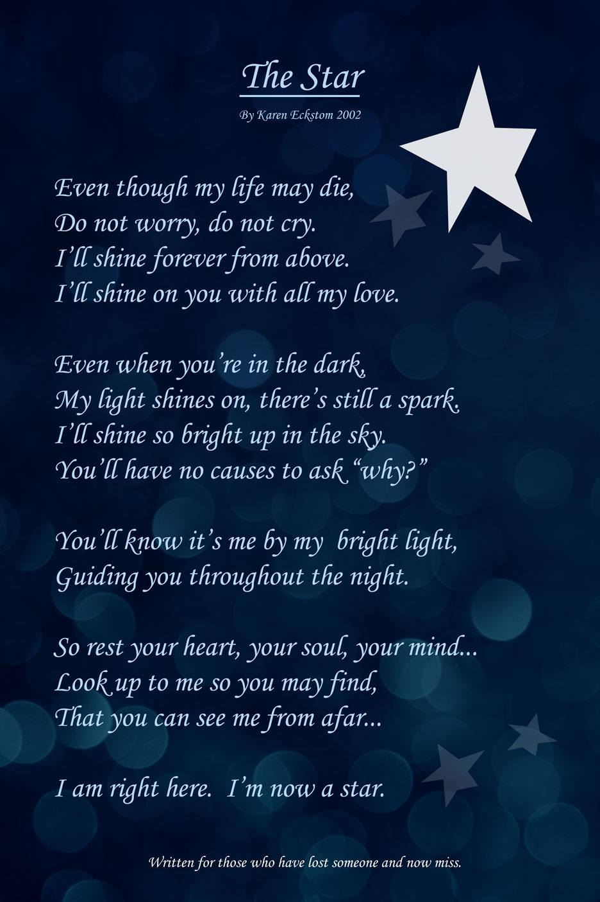

I wrote this a long time ago when my dad died. After yesterday's FB Memory and a several hour weeping session. I decided to rework the design, and post the poem for others.I hope it helps someone out there... they are still here. Just not the way we need or want them to be..

===

